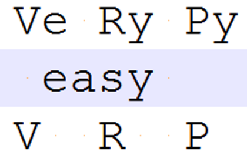
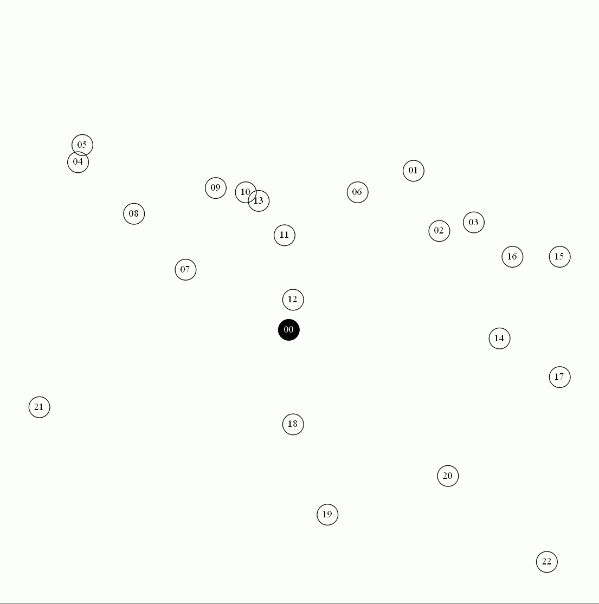

<!-- ```
V  R  P
Ve Ry Py
 easy
``` -->

<!-- TODO: check and update these badges from shield.io and travis-ci.org -->
<!-- TODO: upload to PyPI -->
<!-- [](https://badge.fury.io/py/flair) -->
<!-- [](https://github.com/zalandoresearch/flair/issues) -->
[](https://opensource.org/licenses/MIT)
<!-- TODO: https://www.smartfile.com/blog/testing-python-with-travis-ci/ -->
<!-- [](https://travis-ci.org/zalandoresearch/flair) -->

*Save your effort with VeRyPy and avoid reimplementing the best-known classical VRP heuristic algorithms.*

VeRyPy is an **easy** to use **Python** library of classical Capacitated **Vehicle Routing Problem** (CVRP) algorithms with **symmetric** distances. Many planning tasks such as delivery truck route planning, grocery or meal deliveries, school bus routing, service visit routing, waste collection, and many others can be modeled as a such capaciated vehicle routing problem. Besides CVRPs, the enclosed implemented algorithms can also be used to solve travelling salesman problems (TSP). The code is published with a very permissive MIT license and the files are very loosely coupled. This means you can take just the algorithms or the functionality you need in your studies, in your academic research project, or to solve the real-world logistics planning problems you are facing. 

## Introduction

Compared to the existing heuristic and metaheuristic open source VRP libraries such as [VRPH](https://projects.coin-or.org/VRPH), [Google OR-Tools](https://developers.google.com/optimization/), the focus in VeRyPy has been in reusability of the code and in faithful recreation of the original algorithms. Because of this specific goal, the algorithm codes can replicate the existing results from the literature. Also, there is no architecture astronautery in VeRyPy. Instead, the focus is entirely on the Python functions implementing the classical algorithms. The lightness of the framework is very much intentional-Many existing libraries are complex beasts to reason about and understand, which severely limits their use in a more exploratory setting.

However, please note that the limitations of VeRyPy are also related to the main aims of this project, that is, of replication and simplicity: it is not the fastest, the most sophisticated, nor the most effective library for solving these problems. For example, it being tested only on symmetric distances limits its real-world use. For an implementation of a state-of-the-art CVRP algorithm, please consider checking out, e.g., the [HGS-CVRP](https://github.com/vidalt/HGS-CVRP) from Thibaut Vidal. However, if you **are** just looking for something simple, VeRyPy might be a perfect fit!

Additionally, an ensemble of relatively simple heuristics can be an effective and robust way to solve practical problems. Learning and experimenting on the advantages and disadvantages of the different approaches before rolling out a more specialized and sophisticated algorithm can be very fruitful. Furthermore, the quality of the solutions produced by the state-of-the-art metaheuristics often depend on the quality of the initial solutions and VeRyPy can be used to produce a varied set of initial solutions for these more advanced methods.

## Features

* Implementations of 15+ CVRP heuristics that are:
  * deterministic,
  * classical (from 60ies to mid 90ies, well-cited),
  * constructive (as opposed to improvement heuristics), and which are
  * tested on a comprehensive set of 454 well-known CVRP benchmark instances.
  * The correctness of implementation is shown through replication of the original results, where
    * the results are replicated perfectly or near perfectly for 11 of the classical heuristics, but
    * for 4 of the classical heuristics, the results are bit ambigious.
  * For a full list, see [the heuristics list with references](#implemented-heuristics-with-references).
* Collection of local search heuristics:
  * intra route: 2-opt, 3-opt, relocate, exchange
  * inter route: insert, 2-opt*, 3-opt*<sup>1</sup>, one-point-move, two-point-swap, redistribute, chain
* Wrappers for [LKH](http://akira.ruc.dk/~keld/research/LKH/), [ACOTSP](http://www.aco-metaheuristic.org/aco-code/public-software.html), and [Gurobi TSP](https://www.gurobi.com/documentation/8.1/examples/tsp_py.html) solvers
* Command Line user Interface (CLI) for using the library and algorithm codes
* Integration, replication, and even some unit tests
* Imports TSPLIB compatible CVRP and TSP files
* Exports VRPH compatible solutions 
* Visualizer for many of the 15 heuristics 
* Included is [an example](examples/bing_maps_example.py) that uses [Bing maps API](https://www.bingmapsportal.com/) to use street addresses, calculate distances in a real road network, and solve the related CVRP truck/delivery dispatching task.
* Most of the algorithms are able to solve CVRP instances up to 1000 customers in under an hour
* The fastest of the algorithms can tackle problems with over 10 000 customers in a reasonable time

<sup>1</sup> In fact, due to its inherent complexity, this just might be the only open source implementation of the 3-opt* (3-opt-star aka.  inter-route 3-opt aka. multiroute 3-opt) operation out there!

<!-- TODO: animated gifs of the heuristics here -->
<!-- 
## Performance
TODO: Comparison to SOTA.
      e.g., https://www.localsolver.com/benchmarkcvrp.html
TODO: Replication results.
TODO: Time complexity curves from the paper
-->


*Example of Gillet & Miller Sweep heuristic solving a 22 customer problem instance from Gaskell*

## Citing VeRyPy

If you find VeRyPy useful in your research and use it to produce results for your publications please consider citing it as:

> Rasku, J., Kärkkäinen, T., & Musliu, N. (2019). Meta-Survey and Implementations of Classical Capacitated Vehicle Routing Heuristics with Reproduced Results. In J. Rasku, *Toward Automatic Customization of Vehicle Routing Systems* (pp. 133-260). JYU Dissertations 113, University of Jyväskylä, Finland.

## Quick Start

Make sure that the VeRyPy is in your `PYTHONPATH`. On linux the relevant command is
```
$ export PYTHONPATH=$PYTHONPATH:/home/jussi/Projects/CVRP:/home/jussi/Projects/CVRP/VeRyPy
```
and on Windows 
```
> set PYTHONPATH=%PYTHONPATH%;C:\users\jussi\Projects\CVRP;C:\users\jussi\Projects\CVRP\VeRyPy
```
Be sure to modify the paths as necessary.

The command line use of VeRyPy assumes TSPLIB formatted files (assuming VeRyPy is in your PYTHONPATH):
```bash
$ python -O VeRyPy.py -a all E-n51-k5.vrp
```

> Note: running with `python -O` entirely disables `__debug__` and logging.

An an alternative way of using VeRyPy, this simple Python code illustrates the API usage:
```python
import cvrp_io
from classic_heuristics.parallel_savings import parallel_savings_init
from util import sol2routes

E_n51_k5_path = r"E-n51-k5.vrp"

problem = cvrp_io.read_TSPLIB_CVRP(E_n51_k5_path)

solution = parallel_savings_init(
    D=problem.distance_matrix, 
    d=problem.customer_demands, 
    C=problem.capacity_constraint)

for route_idx, route in enumerate(sol2routes(solution)):
    print("Route #%d : %s"%(route_idx+1, route))
```

<!-- TODO: Make sure it works -->

<!-- TODO: A more comprehensive reference documentation can be found [here](/doc/). -->

For API use, be sure to set the `PYTHONPATH` correctly.

### Dependencies and Installation

VeRyPy requires Python 2.7, NumPy, and SciPy. However, it should be Python3 compatible and *seems* to work also on Python 3.8. For CLI use you also need `natsort` from PyPI and some algorithms have additional dependencies: [CMT79-2P](#CMT79-2P), [FR76-1PLT](#FR76-1PLT), [GM74-SwRI](#GM74-SwRI) and [WH72-SwLS](#WH72-SwLS) require `orderedset` from PyPI; [MJ76-INS](#MJ76-INS) needs `llist` from PyPI; and [FR76-1PLT](#FR76-1PLT) , [FG81-GAP](#FG81-GAP), and [DV89-MM](#DV89-MM) require Gurobi with `gurobipy`. By default [Be83-RFCS](#Be83-RFCS), [SG82-LR3OPT](#SG82-LR3OPT), and [Ty68-NN](#Ty68-NN) use [LKH](http://akira.ruc.dk/~keld/research/LKH/) to solve TSPs, but they can be configured to use any other TSP solver (such as the internal one) if these external executables are not available. Refer to [auxiliary documentation](LKH_install_notes.md) on how to compile LKH.

Be sure to add the VeRyPy root folder to your `PYTHONPATH` environment variable.


<!-- TODO: insert dependency / object diagram here-->

## Contributing and Contacting

Please consider contributing to VeRyPy. But, if this library does not meet your needs, please check the alternatives: [VRPH](https://projects.coin-or.org/VRPH), [Google OR-Tools](https://developers.google.com/optimization/). In order to avoid reinventing (rewriting?) the wheel, please fight the [NIH](https://en.wikipedia.org/wiki/Not_invented_here) and consider the aforementioned options before rolling out your own VRP/TSP library.

All contributions including, but not limited to, improving the implemented algorithms, implementing new classical heuristics or metaheuristics, reporting bugs, fixing bugs, improving documentation, writing tutorials, or improving the usability of the library are welcome. However, please note that any contributions you make will be under the MIT Software License. Even if you are not that much into coding please note that blogging, tweeting, and just plain talking about VeRyPy will help the project to grow and prosper.

When contributing:
* Report bugs using Github issues, and, while doing so, be specific and show how to reproduce the bug
* Use a consistent Pythonic coding style (PEP 8)
* The comments and docstrings have to be written in NumPy Style

Feature requests can be made, but there is no guarantee that they will be addressed. For a more complex use cases one can contact Jussi Rasku who is the main author of this library: <jussi.rasku@jyu.fi> .

If you are itching to get started, please refer to the todo list below:

* [Package project](https://github.com/yorak/VeRyPy/issues/2) for `pip` to make it easier to install
* [Transform all docstrings to NumPy format](https://github.com/yorak/VeRyPy/issues/3) and generate restructured documentation (work ongoing by yorak)
* [Implement the inter-route 3-opt*](https://github.com/yorak/VeRyPy/issues/5#issue-665048120) that only operates on the selected 2 or 3 routes (as opposed to the proven solution-based version can be used as an reference). This work has been started, but not completed.
* Consider verifing the support for asymmetric problems. Most of the algorithms should support this already, but more tests should be written to verify this.
* Consider adding support for time windows (VRPTW). This would probably lead to a major refactoring, but could be an interesting exercise.


## Implemented Heuristics with References

<!-- [CMT79-2P](#CMT79-2P) -->
`cmt` : Christofides, Mingozzi & Toth (1979) two phase heuristic.
> <a name="CMT79-2P">CMT79-2P</a>: Christofides, N., Mingozzi, A., and Toth, P. (1979). The vehicle routing problem. In Christofides, N., Mingozzi, A., Toth, P., and Sandi, C., editors, Combinatorial Optimization, chapter 11, pages 315-338. Wiley.

<!-- [FJ81-GAP](#FJ81-GAP) -->
`gap` : Fisher & Jaikumar (1981) generalized assignment problem (GAP) heuristic. *Requires Gurobi.*
> <a name="FJ81-GAP">FJ81-GAP</a>: Fisher, M. L. and Jaikumar, R. (1981). A generalized assignment heuristic for vehicle routing. Networks, 11(2):109-124.

<!-- [GM74-SwRI](#GM74-SwRI) -->
`gm` : Gillett & Miller (1974) Sweep algorithm with emering route improvement step.

`swp` : Sweep algorithm without any route improvement heuristics.

> <a name="GM74-SwRI">GM74-SwRI</a>: Gillett, B. E. and Miller, L. R. (1974). A heuristic algorithm for the vehicle-dispatch
problem. Operations Research, 22(2):340-349.

<!-- [Ga67-PS|𝜋𝜆](#Ga67-PS|𝜋𝜆) -->
`gpl` : Parallel savings algorithm with Gaskell (1967) with the 𝜋 and 𝜆 criteria.
> <a name="Ga67-PS|𝜋𝜆">Ga67-PS|𝜋𝜆</a>: Gaskell, T. (1967). Bases for vehicle fleet scheduling. Journal of the Operational Research Society, 18(3):281-295.

<!-- [Pa88-PS|G2P](#Pa88-PS|G2P) -->
`gps` : Paessens (1988) parametrized parallel savings algorithm.
> <a name="Pa88-PS|G2P">Pa88-PS|G2P</a>: Paessens, H. (1988). The savings algorithm for the vehicle routing problem. European Journal of Operational Research, 34(3):336-344.

<!-- [HP76-PS|IMS](#HP76-PS|IMS) -->
`ims` : Holmes & Parker (1976) parallel savings supression algorithm.
> <a name="HP76-PS|IMS">HP76-PS|IMS</a>: Holmes, R. and Parker, R. (1976). A vehicle scheduling procedure based upon savings and a solution perturbation scheme. Journal of the Operational Research Society, 27(1):83-92.

<!-- [SG84-LR3OPT](#SG84-LR3OPT) -->
`lr3o` : Stewart & Golden (1984) 3-opt* heuristic with Lagrangian relaxations.
> <a name="SG84-LR3OPT">SG84-LR3OPT</a>: Stewart, W. R. and Golden, B. L. (1984). A Lagrangean relaxation heuristic for vehicle routing. European Journal of Operational Research, 15(1):84-88.

<!-- > [DV89-MM](#DV89-MM) -->
`mbsa` : Desrochers and Verhoog (1989) maximum matching problem solution based savings algorithm. *Requires Gurobi.*
> <a name="DV89-MM">DV89-MM</a>: Desrochers, M. and Verhoog, T. W. (1989). G-89-04 : A matching based savings algorithm for the vehicle routing problem. Technical report, GERAD, Montreal, Canada.

<!-- > [MJ76-INS](#MJ76-INS) -->
`mj` : Mole & Jameson (1976) sequential cheapest insertion heuristic with a route improvement phase.
> <a name="MJ76-INS">MJ76-INS</a>: Mole, R. and Jameson, S. (1976). A sequential route-building algorithm employing a generalised savings criterion. Journal of the Operational Research Society, 27(2):503-511.

<!-- > [CW64-PS](#CW64-PS) -->
`ps` : Clarke & Wright (1964) parallel savings algorithm.
> <a name="CW64-PS">CW64-PS</a>:Clarke, G. and Wright, J. W. (1964). Scheduling of vehicles from a central depot to a number of delivery points. Operations Research, 12(4):568-581.

`ptl` : Foster & Ryan (1976) Petal set covering algorithm. *Requires Gurobi.*
> <a name="FR76-1PTL">FR76-1PTL</a>: Foster, B. A. and Ryan, D. M. (1976). An integer programming approach to the vehicle scheduling problem. Journal of the Operational Research Society, 27(2):367-384.

`pi`, [vB94](#vB94)-PI : parallel insertion heuristic as described by van Breedam (1994, 2002).

`pn`, [vB94](#vB94)-PNN : Parallel Nearest Neighbor construction heuristic.

`si`, [vB94](#vB94)-SI : Sequential cheapest insertion heuristic without local search (van Breedam 1994, 2002).

`sn`, [vB94](#vB94)-SNN : Sequential Nearest Neighbor construction heuristic as described by van Breedam (1994).

> <a name="vB94">vB94</a>: Van Breedam, A. (1994). An Analysis of the Behavior of Heuristics for the Vehicle Routing Problem for a Selectrion of Problems with Vehicle-related, Customer-related, and Time-related Constraints. PhD thesis, Faculty of Applied Economics, University of Antwerp, Belgium - RUCA. 
> 
> and
> 
> Van Breedam, A. (2002). A parametric analysis of heuristics for the vehicle routing problem with side-constraints. European Journal of Operational Research, 137(2):348-370.

`rfcs` : Route-first-cluster-second heuristic of Beasley (1983).
> <a name="Be83-RFCS">Be83-RFCS</a>: Beasley, J. E. (1983). Route first - cluster second methods for vehicle routing. Omega, 11(4):403-408.

<!-- [We64-SS](#We64-SS) -->
`ss` : Webb (1964) sequential savings algorithm.
> <a name="We64-SS">We64-SS</a>: Webb, M. (1964). A study in transport routing. Glass Technology, 5:178-181.

<!-- [Ty68-NN](#Ty68-NN) -->
`ty` : Tyagi (1968) Nearest Neighbor construction heuristic. 
> <a name="Ty68-NN">Ty68-NN</a>: Tyagi, M. S. (1968). A practical method for the truck dispatching problem. Journal of the Operations Research Society of Japan, 10:76-92.

<!-- [WH72-SwLS](#WH72-SwLS) -->
`wh` : Sweep heuristic with Wren and Holliday (1972) improvement procedures.
> <a name="WH72-SwLS">WH72-SwLS</a>: Wren, A. and Holliday, A. (1972). Computer scheduling of vehicles from one or more depots to a number of delivery points. Journal of the Operational Research Society, 23(3):333-344.

## License

VeRyPy is licensed under the MIT license.

Permission is hereby granted, free of charge, to any person obtaining a copy of this software and associated documentation files (the "Software"), to deal in the Software without restriction, including without limitation the rights to use, copy, modify, merge, publish, distribute, sublicense, and/or sell copies of the Software, and to permit persons to whom the Software is furnished to do so, subject to the following conditions:

The above copyright notice and this permission notice shall be included in all copies or substantial portions of the Software.

THE SOFTWARE IS PROVIDED "AS IS", WITHOUT WARRANTY OF ANY KIND, EXPRESS OR IMPLIED, INCLUDING BUT NOT LIMITED TO THE WARRANTIES OF MERCHANTABILITY, FITNESS FOR A PARTICULAR PURPOSE AND NONINFRINGEMENT. IN NO EVENT SHALL THE AUTHORS OR COPYRIGHT HOLDERS BE LIABLE FOR ANY CLAIM, DAMAGES OR OTHER LIABILITY, WHETHER IN AN ACTION OF CONTRACT, TORT OR OTHERWISE, ARISING FROM, OUT OF OR IN CONNECTION WITH THE SOFTWARE OR THE USE OR OTHER DEALINGS IN THE SOFTWARE.


 
